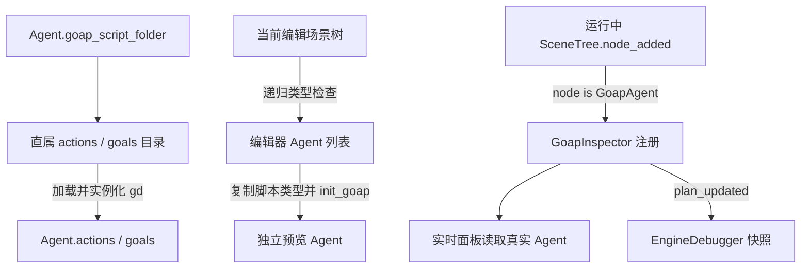

# 发现机制与运行调试

[文档首页](README.md)

## 先区分三个界面

| 入口 | 数据来源 | 能做什么 |
| --- | --- | --- |
| 编辑器顶部 **GOAP** 的 Definitions / Preview | GDScript 与独立创建的预览 Agent | 浏览定义、新建脚本、查询引用、修改假设事实与结构预览 |
| 游戏运行中的 **GOAP** 检查器 | 游戏进程中的真实 Agent / Plan | 看当前步骤、实时事实和动作完成日志 |
| 编辑器 **GOAP → Runtime** / **Debugger → GOAP** | 运行会话的通用统计与选中实例的调试消息 | Performance 查看全会话性能；其余页面查看计划、目标筛选、成本比较和事件时间线 |

Definitions / Preview 不会自动变为实时数据，运行时观察需要切换 Runtime 并选择实例；底部 Goap 保留工作区入口。

## 两层发现机制



第一层由 Agent 在初始化时加载 Action / Goal，父目录不必叫 `ai`。第二层由调试工具发现 **GoapAgent 类型的节点**，不再从目录推断游戏中有哪些角色，也不要求节点名必须是 `GoapAgent`。

## 编辑器如何发现与预览

启用插件后，[plugin.gd](../addons/goap/plugin.gd) 注册 GOAP 主工作区、底部入口和 EditorDebuggerPlugin，不修改项目的自动加载列表。游戏需要远程观察时，自行将 [goap_debugger_autoload.gd](../addons/goap/debugger/goap_debugger_autoload.gd) 以 `GoapInspector` 名称加入自动加载；示例项目已显式加入。场景切换会请求刷新。Window 将工作区移入独立窗口，关闭窗口后回到顶部 GOAP；切换显示方式保留假设事实。

[goap_visual_view.gd](../addons/goap/visual_editor/goap_visual_view.gd) 的 `refresh_agents()` 从 `EditorInterface.get_edited_scene_root()` 递归遍历子节点，把 `is GoapAgent` 的节点加入下拉列表，使用实例 ID 关联选择项。这里只查当前打开的编辑场景，不扫描工程中的全部 `.tscn`。

选择节点、切换场景、显示面板时会刷新。选中 Agent 自身、其后代，或只有一个 Agent 后代的角色父节点都可以定位；多 Agent 父节点有歧义时用下拉框选择。必要时点击 Reload。

`reload()` 不直接执行编辑场景里的 Agent，而是：

1. 取得所选节点的脚本并 `.new()`，创建不加入场景树的预览 Agent。
2. 复制 Agent 的脚本目录配置，调用 `init_goap(source_agent.goap_script_folder)`，初始化事实并加载脚本定义。
3. 收集当前世界、动作前提/效果和目标中的事实键，生成 Fact 列表；这些事实值合起来构成 World state。
4. 对选定目标调用结构搜索 `search_snapshot(..., 1000)`，生成计划浏览器与依赖图。

它不复制运行中的角色、库存或所有 Inspector 配置，也不会调用角色物理处理来收集观测。示例预览从资源场景配置和角色脚本默认值构建假设；代码注册、需要角色上下文的动态定义目前不能完整预览。左侧 Priority 使用预览世界状态调用 Goal 的 `get_priority()`；Plan 的 Base cost 是动作声明成本之和。运行时的 Action 可用性与动态成本仍需在游戏中评估，方案按步骤数展示。

操作流程：打开 `goap_example/world.tscn` → 顶部 GOAP → 选择 Agent → Preview → 选择 Goal。Plans 左侧选方案组，中间看执行步骤，Order 切换相同动作集合的不同顺序；点击步骤查看 Details 和条件来源。Details 中的 Initial world state 复选框可直接调整对应事实并重新规划。World state 同样使用复选框：勾选为 True，取消为 False；未提供的事实也按 False 处理。点击 `↗` 可查询事实的定义引用。Reload 从已保存脚本重建定义并重置假设。

Goal 列表用颜色区分尚未满足和已经满足的目标，并显示预览 Priority。中间的 Plan 列表逐行展示所选 Goal 的动作链及基础成本；Show all 切换为显示所有 Goal 的 Plan，并按 Priority 排序。悬停可查看完整动作链，点击 Plan 后可在右侧 Details 中逐步检查动作、前提和来源。Details 中的目标事实按钮可在激活值与目标值之间切换；所有快捷修改只影响预览假设，修改后会立即重新规划。

Preview 的 Goal 选择器将 All goals 放在第一项并默认选中，Reload 后也展示全部目标；可选择单个目标。World state 可以按事实名称或键搜索，用 True only 只看当前勾选为 True 的事实。Dependency graph 展示可能的条件提供关系，不是唯一执行顺序。Compact 控制紧凑程度，Frame All 查看全图；已满足事实可以使准备分支隐藏。1000 节点上限触发时面板会标注搜索不完整。


## 定义浏览和脚本新建

在顶部模式选择器切换 **Definitions**。左侧按 Action / Goal / Fact 筛选，也可以搜索名称或稳定 ID。参数化动作分别列出，悬停显示完整 ID；选择 Fact 可打开提供它的 Provider 脚本，也可查看引用它的动作和目标。

点击定义中的事实打开引用列表，分别列出 Requires（动作前提）、Writes（动作效果）和 Desires（目标要求）。引用显示期望/写入的布尔值，点击跳转对应定义。Open action/goal script 或双击定义切换到实际行为/Priority 脚本。动作详情同时显示成本模型路径，点击 **Open cost script** 可直接修改成本逻辑。保存代码后点击 Reload；实际成本值及候选比较在 Runtime 查看。

**+ Action / + Goal** 在当前 Agent 的 `actions/` 或 `goals/` 下创建 `.gd`。输入不含扩展名的 snake_case 文件名、初始效果/目标事实和值；文件名转为 PascalCase 稳定 ID。已有文件或重复 ID 会被拒绝。创建后自动发现并打开脚本，同时保留已有假设事实和目标选择。

Fact 条目由当前事实、Action 前提/效果和 Goal 目标自动汇总。新增运行时事实时，把查询写入对应 `GoapWorldStateProvider`，并将 Provider 挂到场景对象；角色私有事实使用 ACTOR 作用域，外部对象使用 WORLD 作用域。预览里的复选框只改变当前假设，Reload 后从角色默认属性和资源场景配置重建。

新 Action 的 `is_valid()` 默认 false、`perform()` 返回 FAILURE；新 Goal 的 Priority 默认 0。实现实际角色行为、可用性或优先级后再启用，避免空模板宣称执行成功。结构预览包含这些定义，因此不能据此断言它们已经能在游戏中执行。


预览中的事实修改仅用于当前试算，不会写入游戏或文件。切换 Agent、切换场景或 Reload 会重置假设。


## 运行时如何注册与刷新

[goap_debugger_autoload.gd](../addons/goap/debugger/goap_debugger_autoload.gd) 在 `_enter_tree()` 连接 `SceneTree.node_added` 和 `node_removed`。看到 `GoapAgent` 就加入列表并连接 `plan_updated`；离开树时移除并断开监听。动态生成、销毁和切换场景中的 Agent 都通过这些事件更新。

常规自动加载先于主场景进入树，所以能看到后续角色。检查器也会在进入树后延迟扫描一次已有节点，支持晚加入的情况；注册按实例去重，不会每帧扫描树。

[goap_debugger.gd](../addons/goap/debugger/goap_debugger.gd) 的 `inspect(agent)` 绑定实际 Agent，读取 `current_plan`、`current_goal` 和 `world_state`，没有再次实例化目录脚本。编辑预览中的 `source_agent` 是场景实例，`preview_agent` 是单独创建的预览实例。

| 变化 | 刷新方式 |
| --- | --- |
| 计划替换或丢弃 | `agent.plan_updated`，重新绑定当前 Plan |
| 世界事实改变 | `world_state.state_changed` 标记待刷新 |
| 动作成功 | `plan.action_succeeded` 记录日志并标记刷新 |
| 动作开始/步骤变化 | 每帧检查 `plan.step` 与 `_started`；变化才更新显示 |
| Agent 被删除 | 清理选择，切换到剩余 Agent 或空状态 |

实时 World state 是只读显示。Follow current 跟随执行步骤；关闭后可以停留查看其他步骤，Current action 返回当前动作。动作详情显示所选步骤的前提和效果，不是对未来世界状态的绝对保证。


## 显示方式与接入自己的 UI

通用监控位于 `addons/goap/runtime/`。普通图形项目没有 host 时，`GoapInspector` 会显示带 **Performance / GOAP** 两页的 Runtime monitor；标签拖动、Detach tab、停靠、隐藏和重新打开均由插件提供。headless 模式不自动打开窗口，但仍注册 Agent，也可向活动的 EngineDebugger 发送快照。

也可以直接实例化监控场景，不需要启用编辑器插件或 `GoapInspector`。此时监控自己发现 Agent，并创建本地检查器。只复制 `addons/goap` 即可使用：

```gdscript
var monitor: GoapRuntimeMonitor
var game_page_id: int

func _ready() -> void:
    monitor = preload("res://addons/goap/runtime/goap_runtime_monitor.tscn").instantiate()
    add_child(monitor)
    var game_page := Label.new()
    game_page.text = "My game status"
    game_page_id = monitor.register_page(game_page, "Game")
    monitor.show_tab(game_page_id)
```

`register_page()` 在监控 ready 后调用，返回稳定的整数句柄，拖动或停靠不改变它。`show_tab()`、`detach_tab()`、`dock_tab()` 接收该句柄。`unregister_page()` 只移除扩展页并返回其 Control，调用方负责重新挂接或释放；默认 Performance / GOAP 页随监控一起释放。`hide_monitor()` 隐藏所有窗口，`show_monitor()` 重新打开。场景退出时会清理浮动窗口和统计订阅。

Performance 自动发现已有和后来加入的 `GoapAgent`，通过通用 `planning_measured(report)` 信号统计完成请求，分别记录无目标请求、实际规划次数、计算耗时和包含排队的响应时间；取消请求不算完成。调度帧耗时来自同一 SceneTree 的共享调度器。拆窗、停靠不会清空样本，Reset samples 才会清空。这里的候选数来自已完成请求；示例另外提供压力请求的进行中估计。

示例 HUD 继承通用监控场景，把 Agent / Workload 两页固定在游戏画面右侧，地图占左侧，不创建示例弹窗；`include_inspector_page = false` 关闭重复的 GOAP 检查页。Agent 页显示当前 Goal、计划的所有步骤及每个 Action 的成本估算，不显示目标名称和位置。示例 Agent 首次显示一份 Plan 时用当前世界快照计算并缓存这些数字，Core Plan 仍只保存规划总成本，因此逐步显示值可能与先前规划的总成本有差异。Plan Steps 下的 **Why this plan? Show alternatives** 按钮展开实际规划报告：同一 Goal 的其它候选、成本或提前剪枝下界，以及其它 Goal 的优先级与筛选原因。默认少量角色预先采集有界决策报告；若当前 Plan 没有报告，点击按钮会对选中角色重新规划一次以取得比较。它通过 `performance_page_path` 提供 Workload 页；该页仅显示示例压力配置和进度，通用性能指标在编辑器 Runtime 查看。`auto_observe = false` 后由示例控制器选择生存或压力请求调用 `record_planning()`，避免混算或重复统计。其他扩展可覆写 `metric_sections()`、`extra_metric_values()` 和 `extra_metrics_text()`。

**Pause** 可暂停示例的物理更新，再用 **Why this plan? Show alternatives** 对照当前路线与最多五条备选路线。每条路线逐步列出 `Est. Action cost`；这些步骤成本按展开时的世界快照在示例侧估算，不含移动距离，路线下方的 Cost 则是规划当时的成本或剪枝下界，因此数值可能不同。暂停期间 HUD 仍可展开、收起和滚动；如果当前方案尚无比较报告，界面会提示先恢复模拟以完成采集。离开场景时，HUD 会解除自己设置的暂停。

已有 `GoapInspector` 自动加载时，可在准备好的 Control 容器中接入：

```gdscript
extends Control

func _ready() -> void:
    GoapInspector.attach_to(self)

func _exit_tree() -> void:
    GoapInspector.release_from(self)
```

容器需要正常的尺寸与布局约束。`attach_to()` 会创建或迁移视图并释放原来的默认监控窗口；`release_from()` 清除 host 引用，旧场景负责释放其子视图。图形模式下，如果下一个场景没有接入 host，会重新创建默认监控。`GoapInspector.show_window()` 可重新打开被隐藏的默认监控。

Core 不依赖检查器。当前自动显示逻辑没有按 release 构建自动关闭；生产不需要检查器时，从游戏的 autoload 列表移除 `GoapInspector`，同时移除显式实例化的 Runtime monitor。编辑器插件不会自动添加或删除这个单例。示例 HUD 的游戏内 Agent、Workload 页不依赖检查器。

## 编辑器运行观察与决策解释

**打开 Performance：启用 GOAP 插件 → 游戏显式加载 `GoapInspector` → 按 F5 / F6 运行 → 编辑器顶部 GOAP → 模式下拉框选择 Runtime → Performance。** 示例项目已加载该单例。Runtime 默认打开 Performance。底部 **Debugger → GOAP → Performance** 提供同一会话的数据和 Reset samples 操作。

Runtime 顶部的 **Pause game / Resume game** 控制所选调试会话的游戏暂停状态；没有运行会话时按钮不可用。暂停时仍可查看已收到的计划、决策和事件，恢复后继续更新。游戏停止或重新启动后按钮回到 Pause game。

Performance 不需要选中 Agent，也不需要游戏创建 HUD 或 Runtime monitor；游戏进程需要显式加载 `GoapInspector` 才会发送性能数据。无图形窗口的游戏进程连接编辑器调试器时同样发送性能数据。停止游戏后清空数据显示，重新运行会开启新的采样周期。

Performance 汇总当前会话全部 `GoapAgent`：Agent 数、FPS、排队和 worker 数、调度帧耗时与预算、完成请求数、无目标检查数、计算各阶段和包含排队的响应耗时、候选数与截断数。平均值和峰值从进程启动或最近一次 Reset samples 起累计。Reset samples 只重置远程统计，不改变游戏状态、当前计划或观察对象。统计来自独立的 `GoapPerformanceStatistics`，与可选运行窗口共用计算实现；每个调试会话的数据相互独立。

示例中的生存 Agent 与合成压力 Agent 都计入编辑器的全会话统计；游戏内压力页可单独筛选合成请求，因此两处请求总数可能不同。编辑器不提供生成示例角色、饥饿等游戏操作。

查看个体行为时切换其他标签，再选择 Agent。**Debugger → GOAP** 与顶部工作区共用同一会话的观察对象；切换其中一个界面的观察对象会同步到另一个界面。

- **Performance**：全会话的调度、规划和搜索统计；不依赖 Agent 观察，切换观察对象不会清空这些样本。
- **Plan & world state**：当前目标、计划步骤、正在执行的动作、成本、事实、是否仍在规划，以及 Domain 校验错误。
- **Decisions**：最近完成请求的目标筛选原因、动作可用性，以及每个已搜索目标的全部候选 plan、成本与结果。各目标下的候选按显示成本从低到高排列，无效成本排在最后；同成本时完整成本优先于下界，选中方案优先显示。原因来自实际规划阶段，不会额外调用游戏回调猜测决策。未继续搜索的低排名目标明确标记为未搜索。
- **Timeline**：观察开始、事实前后值、动作开始/停止/成功/失败、请求与完成、取消、暂停、实例移除等事件。点击事件会停止跟随，可检查该次规划的历史报告。
- **Snapshot**：当前协议快照及可选搜索 trace，供详细排查。


显示 `≥` 的候选成本是已计算前缀的下界：规划器发现它已经比最佳方案昂贵，便停止继续评估。非法候选的成本显示 null；搜索截断仍明确标记，不表示已证明全局最优或不可达。候选列表完整保留本次搜索实际发现的结果；搜索节点上限仍可能阻止发现更多方案。

详细决策与事件观察从选择实例时开始；在此之前已经开始的请求可能没有决策明细，等待下一次自然请求即可。选择器中的 **Select running Agent / stop observing** 停止该实例的详细采集，Performance 仍继续统计整个会话。实例销毁后清除实时选择，保留有界历史供查看；停止调试会话会清理实例、快照、性能数据和历史。

## 将观察对象与游戏角色对应

在编辑器 **GOAP → Runtime** 的 **Plan & world state / Decisions / Timeline / Snapshot** 页，Agent 列表显示 `#5 · Agent005 / GoapAgent` 这样的身份，悬停可看完整节点路径。编号在同一运行进程内不复用，删除其他 Agent 不会导致现有编号变化；同一角色下的多个 Agent 有各自的编号。

**Show marker in game** 在当前观察 Agent 所属角色上绘制同编号的青色标记。插件查找最近的 Node2D / Node3D / Control 祖先，并使用该角色所在 Viewport 的画布变换或活动 Camera3D 投影；没有空间祖先时会提示无法标记。隐藏、屏幕外或相机后方的角色不显示标记。标记是屏幕叠加，不进行遮挡检测，也不会移动摄像机；它不读取或拦截输入、不改变游戏选择。关闭标记不影响观察，停止观察或销毁 Agent 会移除标记。

**Show all markers** 不需要先选中 Agent，会为所有可标记角色显示与列表一致的编号。当前观察对象保留青色编号和名称，其余使用紧凑的琥珀色编号；同一角色上的多个 Agent 分行显示。新建 Agent 自动加入，删除时移除。与 Show marker in game 同时开启不会重复标记；关闭全部标记后，若单独标记仍开启，会保留当前观察对象的标记。停止观察不会关闭全部标记。

顶部工作区与 Debugger → GOAP 共用手动观察对象和标记选项，Performance 始终统计整个会话。编辑器观察对象由 Agent 列表选择，不会改动游戏中的角色选择。

## 调试协议与开销

协议版本为 2，数据通过 EngineDebugger 在主线程发送。无活动调试器时不创建远程性能采样器，也不发送远程数据。编辑器命令控制观察对象或重置统计，不修改世界事实、强制执行动作或触发重规划。

| 消息 | 用途 |
| --- | --- |
| 编辑器 → `goap:list` | 请求实例注册表 |
| 编辑器 → `goap:observe`，`[instance_id]` | 观察一个实例；0 停止观察 |
| 编辑器 → `goap:show_marker`，`[bool]` | 显示或隐藏当前观察角色的被动标记 |
| 编辑器 → `goap:show_all_markers`，`[bool]` | 显示或隐藏全部可标记 Agent 的编号，不改变观察对象 |
| 编辑器 → `goap:reset_performance`，`[]` | 清空该会话的性能样本并递增采样 epoch |
| 运行时 → `goap:agents` | 实例 ID 与路径；新增/删除时更新 |
| 运行时 → `goap:plan` | 所选实例的计划、步骤、事实、报告和可选 trace；完整决策明细只在报告完成时发送一次 |
| 运行时 → `goap:events` | 所选实例的有序事件批次与丢弃数量 |
| 运行时 → `goap:performance` | 全会话的定长数字统计快照，不需要观察实例 |

注册表、性能和周期快照最多每 0.1 秒真实时间刷新一次，不受模拟速度影响；计划变更还会立即发送实例快照。性能数据只累加完成请求和主线程发布的调度统计，不遍历 worker 数据，也不保存逐帧历史。只有选中 Agent 启用详细事件与规划比较；动作执行中的诊断仅写入缓冲，不在生命周期回调内调用编辑器观察者。运行时最多保留 128 条待发送事件，编辑器每会话最多保留 256 条历史；溢出可见丢弃计数。

目标和动作筛选明细各最多 128 条，最终胜者仍会保留；已搜索目标的候选比较及方案内动作 ID 不采样截断。调试面板在后续实时快照中沿用上次完成请求的决策数据，避免每 0.1 秒重复传送。上下文和线程边界沿用原有规划器；选中实例不会自动启用完整搜索 trace。

在请求开始前将 Agent 的 `debug` 设为 true，搜索才记录 expanded、conflict、cycle、selected 等路径信息；远程快照最多发送前 128 条。关闭时 trace 为空不表示没有规划。开启完整本地 trace 仍有内存和耗时影响，性能测量默认关闭。

## 实际排查顺序

1. 先在编辑器预览检查条件链，确认目标可由已定义动作提供。已满足目标没有步骤是正常结果。
2. F5 / F6 运行，在实时面板选择真正执行的 Agent，核对事实、当前目标与动作。
3. 在 `capture_context()` 断点检查快照来源，在 Action `start/perform/stop` 或角色能力中检查真实执行。后台模型中只看传入数据，不查询场景树。
4. 检查 `planning_statistics.reason` 与 `phase`。`pending` 是等待，`no_goal` 是无需新计划，`unreachable` 是本次候选域无有效解，`node_limit` 是截断；`duplicate_goal_id`、`invalid_input`、`unsafe_cost_model` 表示输入问题。
5. 在 Runtime 的 Decisions / Timeline 查看实际决策与事件；需要搜索细节时在请求前开启 debug，再查看 Snapshot。需要解释慢在哪里时按[统计口径](SCHEDULING.md)区分计算和响应延迟。

等待期间最近报告可能尚未更新，当前面板的“No active plan / Waiting for planning”也不能单独证明调度器正在工作；同时查看 `is_planning()` 和 reason。

## 常见问题

| 现象 | 检查方向 |
| --- | --- |
| 没有加载动作或目标 | `goap_script_folder`、直属 `actions/` / `goals/` 脚本、无必填参数的构造函数 |
| 目标不可达 | 所需的 true 事实是否已感知或可由动作建立、资源观测是否准确；未提供的事实按 false 处理 |
| 动作成功但游戏里没变化 | Effects 只更新规划事实，真实行为必须由角色执行 |
| 建立前提的动作没有被使用 | 是否在 `is_valid()` 中错误排除了未来可以满足的前提 |
| 规划不断重启 | 是否反复显式请求重规划，或不断发布抖动的事实 |
| 目标或资源选择不合理 | 检查游戏的目标优先级与距离规则；Core 不做全局匹配 |
| `unsafe_cost_model` / `invalid_input` | 查看诊断中的动作、脚本行号或快照路径 |
| 返回 null 且 reason 为 `node_limit` | 搜索被截断，不能据此断言不可达 |
