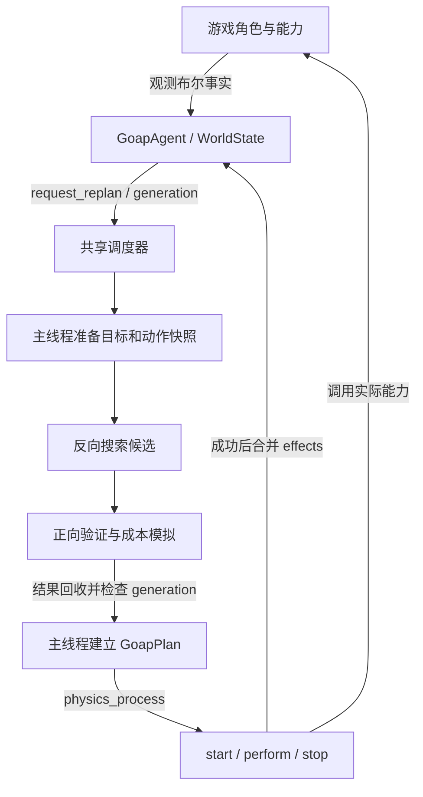

# 设计与执行流程

[文档首页](README.md)

本篇解释 Core 的通用机制。对照实际游戏时，可从[生存示例](../goap_example/README.md)提供的源码入口开始。

## 核心概念与职责边界

| 概念 | 作用 |
| --- | --- |
| `GoapWorldState` | 已知的布尔世界事实 |
| `GoapGoal` | 期望世界状态，以及表示目标重要程度的 Goal Priority |
| `GoapAction` | Preconditions、Effects、Action Cost 与执行回调 |
| `GoapPlan` | 规划器选中的有序动作序列 |
| `GoapAgent` | 连接角色、目标、规划与动作执行 |
| `GoapCostModel` | 比较候选计划所用的纯计算模型 |

Core 统一使用 `world_state` 表示当前事实，`goal_state` 表示目标事实，`preconditions` / `effects` 表示动作的前提与结果，`cost` 表示 Action Cost，`get_priority()` 表示 Goal Priority。

这两种决策必须分开：

- **Goal Priority：** 决定优先追求哪个本地目标，由 `get_priority(world_state)` 计算。
- **Action Cost：** 决定通过哪条计划完成这个目标；计划成本是各动作成本之和。

高 Goal Priority 不会使动作更便宜。

| GOAP Core 负责 | 游戏层负责 |
| --- | --- |
| 搜索、冲突检查和候选评估 | 饥饿、战斗、生命、死亡和复活规则 |
| 目标选择机制与动作生命周期 | 移动、寻路、动画和角色能力 |
| 共用规划预算与过期结果丢弃 | 感知，以及将观测转换为事实 |
| 单个 Agent 的目标排序与计划切换 | 编组、选择执行者、资源与任务分配策略 |
| 成本模型与可用性接口 | 距离、紧迫度、库存和资源可用性规则 |

`GoapAgent.actor` 就是它的父 `Node`。角色可以是 `Node`、`Node2D` 或 `CharacterBody3D`，不必继承 GOAP 专用角色基类。团队 Goal 也由游戏定义；Core 不理解树木、饭菜、编组或物资交付的业务含义。

## 模块与对象所有权

| 模块 / 类型 | 职责与所有权 |
| --- | --- |
| [GoapAgent](../addons/goap/core/goap_agent.gd) | 场景节点；持有自己的事实、动作、目标、当前计划和请求 |
| [GoapWorldState](../addons/goap/core/goap_world_state.gd) | `Dictionary[StringName, bool]`；修改时发信号，复制时隔离字典 |
| [GoapWorldStateProvider](../addons/goap/core/goap_world_state_provider.gd) | 场景对象的只读观测接口；Agent 选择发现范围，汇总能力查询并发布纯数据快照 |
| [GoapAction](../addons/goap/core/goap_action.gd)、[GoapGoal](../addons/goap/core/goap_goal.gd) | `RefCounted` 定义与回调；Action 还可能持有执行状态，应每个 Agent 独立实例化 |
| [GoapPlanningScheduler](../addons/goap/core/goap_planning_scheduler.gd) | 每个 SceneTree 一个；弱引用排队 Agent，持有尚未回收的后台请求 |
| [GoapPlanningRequest](../addons/goap/core/goap_planning_request.gd) | 主线程上的单次请求状态机；弱引用 Agent、记录 generation、准备快照和候选目标 |
| [GoapPlanningWork](../addons/goap/core/goap_planning_work.gd) | 串联搜索和评估；工作数据在主线程与 worker 之间按片段交接 |
| [GoapPlanningSnapshot](../addons/goap/core/goap_planning_snapshot.gd) | 同步与分帧路径共用的动作记录、ID 校验、不可变 Effect 索引缓存与预热 |
| [GoapPlanningData](../addons/goap/core/goap_planning_data.gd) | 工作阶段枚举、统计与评估结果构造 |
| [GoapSearch](../addons/goap/core/goap_search.gd) | 可暂停的反向 DFS；只处理布尔快照、动作索引、搜索栈 |
| [GoapEvaluation](../addons/goap/core/goap_evaluation.gd) | 正向验证候选，模拟成本，选择获胜动作索引序列 |
| [GoapPlanningSafety](../addons/goap/core/goap_planning_safety.gd) | 快照纯数据检查、成本源码审计、诊断缓存与告警 |
| [GoapPlanner](../addons/goap/core/goap_planner.gd) | 快照与索引工具、同步规划入口、结果统计；不调度真实角色行为 |
| [GoapPlan](../addons/goap/core/goap_plan.gd) | 持有选中动作的原实例，保存执行步号，调用生命周期回调 |
| `visual_editor/`、`debugger/`、`ui/` | 编辑器预览、实时观察、远程快照与共用显示组件；不是规划核心依赖 |
| `goap_example/` | 角色能力、世界观测、资源竞争和生存规则；不是 Core 的内置能力 |

Action 和 Goal 是对象，不是子节点。调试器先发现 Agent，才通过它访问动作和目标。目录发现与场景发现的详细过程见[调试文档](DEBUGGING.md)。

动作、目标和成本模型以 GDScript 为唯一行为定义来源，支持目录加载与代码注册的参数化实例。工作台读取脚本定义与运行时快照，提供浏览、结构预览和真实决策解释，不维护另一套 `.tres` 领域定义。

## 一次运行的完整链路

1. Agent 在 `_enter_tree()` 调用 `init_goap()`，创建世界状态并连接变化信号，按配置加载动作和目标。在 `_ready()` 请求初始规划。
2. `request_replan()` 增加 generation、标记待规划并记录请求时间。物理帧将 Agent 加入共享调度器，同时继续执行当前计划。
3. 调度器在渲染帧 `_process()` 中轮转请求。准备阶段检查当前计划有效性，复制世界事实，选择目标并采集动作快照。
4. 默认在 worker 上执行搜索与评估；关闭 `asynchronous_planning` 后相同步骤在主线程分片执行。
5. 后台片段完成后，调度器先等待任务完成，再允许主线程读取结果。请求过期则丢弃；有效结果的动作索引映射回本次请求保存的 Action 原实例。
6. 新计划安装到 Agent，发出 `plan_updated`。动作实际执行由物理帧推进；worker 不调用角色移动、动画或资源消耗。

## 目标选择

本地 Goal 必须有效、期望事实尚未满足、Priority 有限且大于 0。候选按 Priority 降序，同值按稳定 ID 排序。先完整尝试最高排名目标；无可用计划才继续下一目标，不把多个目标的 Priority 与计划 Cost 混成一个分数。

有有效计划时，当前目标仍会因世界状态变化而重新规划；若新计划与剩余动作相同，则继续执行。所有有效目标直接按 Priority 排序，同值按稳定 ID 排序；更高排名且可达的目标可以替换当前计划。当前计划失效时先丢弃。

## 搜索与评估为什么分开

布尔事实决定动作是否能构成目标的因果链；动作声明成本和可选的动态成本模型决定这些链的成本。反向搜索只处理事实，因此先搜结构，再正向累计每条候选的成本。

反向搜索的每个节点保存 required 事实、动作序列和本分支祖先状态键：

1. 如果初始世界满足全部 required，记录当前序列为候选，结束该分支。
2. 根据 Effect 索引查找能提供所需事实的动作。
3. 检查效果与 required 的冲突；从 required 中去掉该动作提供的条件，再加入其前置条件。前置条件与剩余 required 冲突也会剪枝。
4. 对回归后的事实生成排序后的规范键。仅在本分支祖先中查重，避免结构循环；其他路径仍可继续。
5. DFS 继续展开，直至栈为空或达到节点上限。

不能先删除所有“初始已满足”的要求。例如世界 `b=true`，目标 `a=true,b=true`，动作产生 `a=true,b=false`；提前删除 `b` 会错误地把这个动作视为解。当前实现保留完整回归要求，允许通过显式恢复动作修复破坏性效果。

评估阶段逐条正向执行候选的模拟：从世界与成本状态副本开始，验证每步 preconditions，计算有限且非负的 Cost，应用模拟成本效果与布尔 effects，最后验证目标。默认动作成本为 1。先选总成本最低的候选，同成本选步骤更少的候选；成本和步数都相同时按动作 ID 序列字典序决胜。累计成本已经严格高于当前最优时可以安全停止该候选。

不同路径即使布尔事实相同，模拟位置也可能不同，所以不能直接用“布尔状态 → 最低成本”全局去重。Context、Simulation 和线程边界见[成本模型](COSTS.md)。

## 搜索保证与边界

默认每个目标最多展开 10000 个节点。达到上限时，已找到的候选仍会评估；有有效候选可以返回计划，但 `search_complete=false`、`reason=node_limit`。没有候选时返回 `null` 也不能证明不可达。预算耗尽只是暂停，与节点上限不同。

最优性只在枚举到的、结构无环的回归路径内成立。初始世界满足分支要求后就停止，不会额外插入仅用于降低后续成本的绕路、准备步骤或循环。需要这样的行为时，应建模有意义的依赖和替代动作，不能宣称当前算法在任意动态成本领域全局最优。

未提供的世界事实按 `false` 处理，满足要求 false 的前提和目标。动作定义中省略的前提不作要求，省略的效果不修改事实。该模型没有数值型前提、不等式或固定大小位集；数值由游戏持有并映射为布尔条件，成本计算用独立数值快照。

## 执行动作与重新规划

计划按顺序执行。在每次 `execute()` 中先检查当前动作的前置条件和 `is_valid(agent)`，首次执行调用 `start()`，之后调用 `perform()`。RUNNING 保持当前步骤；SUCCESS 清理并合并效果后推进；FAILURE 清理并反馈给 Agent。空计划直接成功。

普通动作失败会丢弃计划并请求重规划。目标完成或失效也会清理。有效的旧计划可以在新请求等待期间继续执行；新计划安装前会停止旧计划。

`stop()` 应释放资源、停止移动并取消自己拥有的执行，真实游戏行为不能只依靠 effects。执行过程在回调边界验证计划版本与所有权：`stop()` 同步切换任务后不会应用旧效果或发送成功通知。效果合并后的状态通知中切换任务不回滚已提交效果，但会停止旧执行。成功信号期间 `step` 仍指向刚完成的动作，回调返回且计划仍有效时再推进。回归测试见 `tests/lifecycle_reentrancy.gd`。

Agent 离开树时增加 generation、从调度器移除、取消请求并停止动作。调度器退出时等待已派发片段完成。工作片段是协作式的，长时间不返回的自定义成本函数仍会拖延回收。
